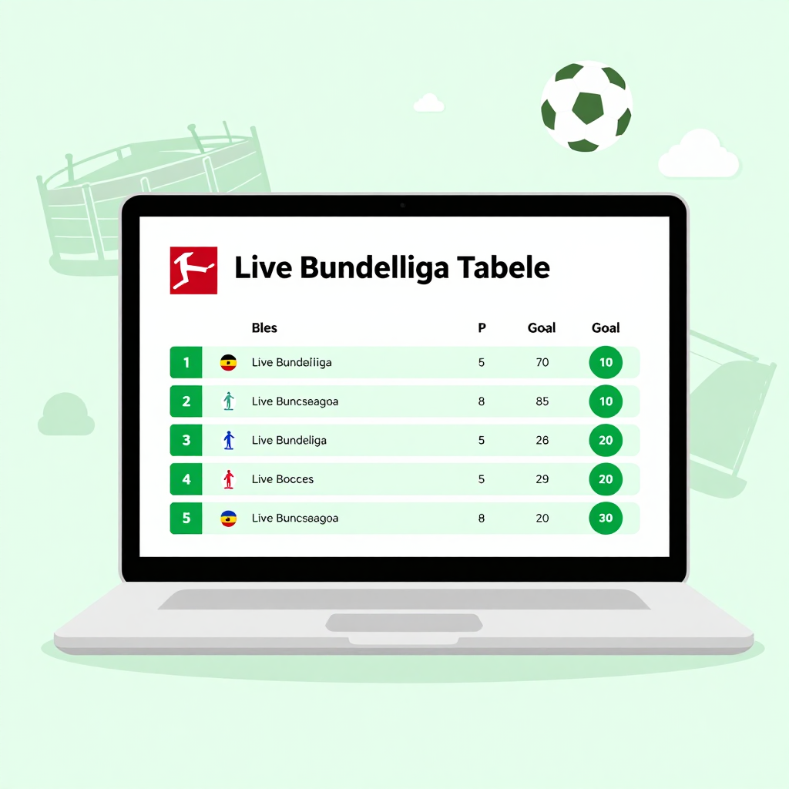

# Live-Bundesliga-Tabelle



Ein kleines HTML‑Projekt, das beim Aufruf automatisch die aktuelle 1. Bundesliga‑Tabelle (Saison 2025/26) per **OpenLigaDB**‑API lädt und anzeigt.

## Dateien
- `index.html` – das eigentliche HTML‑Gerüst inkl. CSS‑Styling und JavaScript‑Logik.  Der `<title>`‑Tag im `<head>` enthält das aktuelle Saison‑Jahr (z. B. `Saison 2025/26`).

## Nutzung
1. Repository klonen oder das `index.html`‑File herunterladen.
2. Im Browser öffnen – die Tabelle wird beim Laden automatisch aktualisiert.

## Neue Saison einbinden
Im `index.html`‑File gibt es zwei Stellen, die angepasst werden müssen:
- Die Variable `season` im JavaScript (derzeit `2025`). Für die nächste Saison einfach:
  ```js
  const season = 2026; // z. B. für Saison 2026/27
  ```
- Der `<title>`‑Tag im `<head>` (derzeit `Bundesliga‑Tabelle (Live, Saison 2025/26)`). Passe das Jahr dort ebenfalls an, damit das Browser‑Tab korrekt angezeigt wird.

Speichern, committen und pushen – die Seite zeigt die neue Tabelle.

## Hinweis
Das Projekt verwendet nur plain HTML/CSS/JS – kein Build‑Tool nötig.
